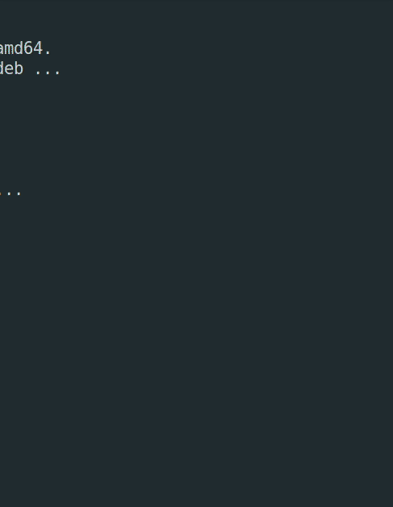

<h1> PacmanWithAI </h1>



<p>The game of Pacman that uses an Artificial Intelligence based on graphs.</p>

<h2> How to compile the game: </h2>
<p>First things first! You will need the <strong>allegro 5</strong> library installed in your system, it is quite lightweigth:</p>

```bash
sudo apt-get update
sudo apt-get install liballegro5-dev
```
<p>After that, go to the <i>src</i> directory and do the following instructions:</p>

```bash
make clean
make
./main
```
<h2>Techniques used:</h2>

<h3>Graphs:</h3>
<p>The main use for the graphs, aside from the Artificial Inteligence implementation, was used on the movimentation of the character and the ghosts.</p>
<h3>Breadth first search on graphs:</h3>
<p>The Artificial Inteligence used on the ghost used the Breadth firts search on graphs.</p>
